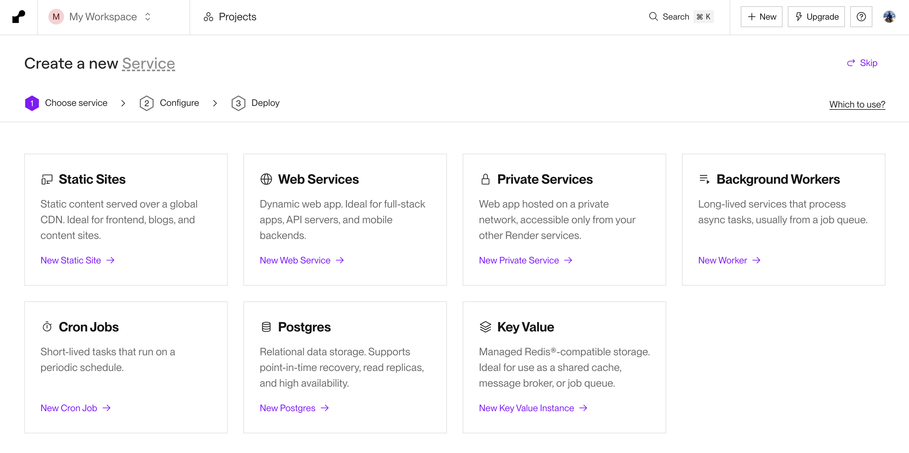
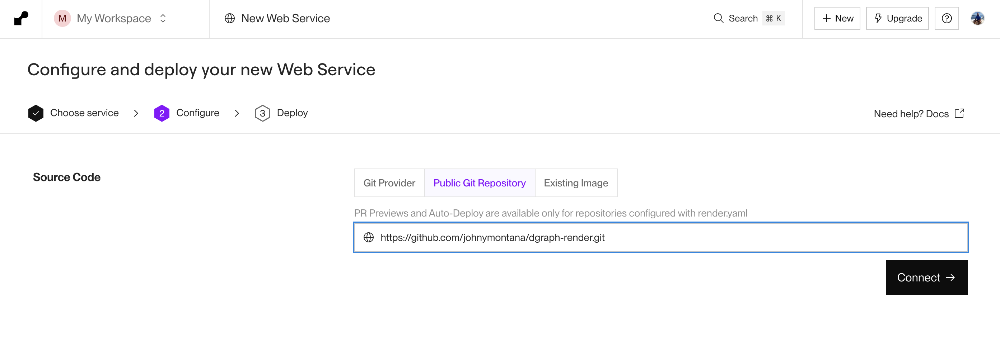
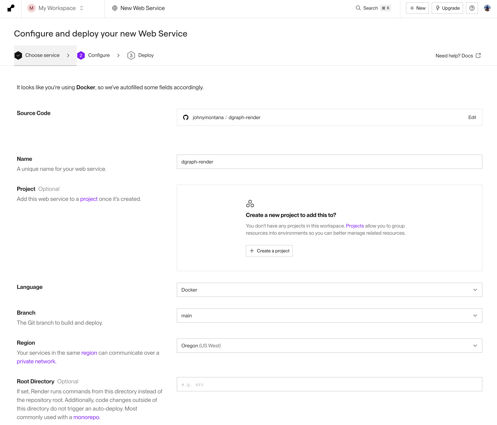
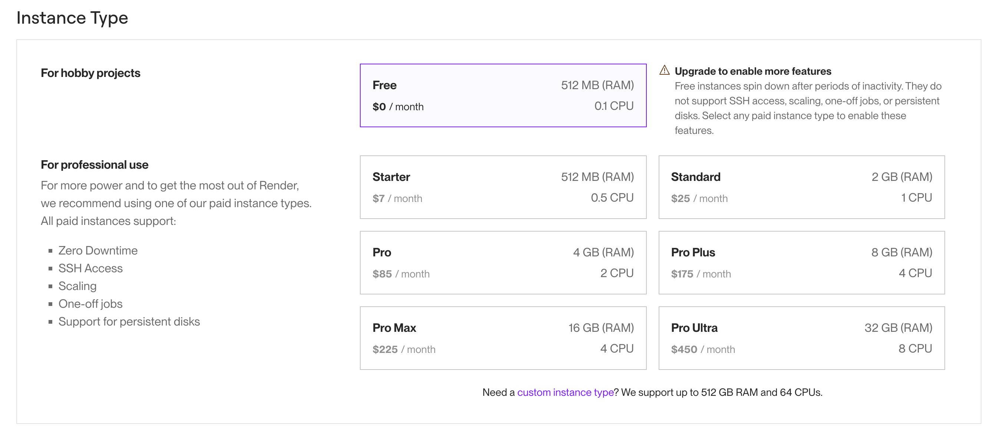
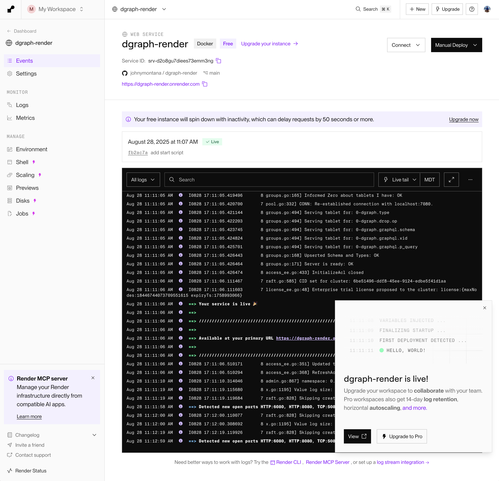

# Dgraph Standalone Deployment On Render Guide


This guide walks you through deploying Dgraph as a self-hosted solution on Render using the Dgraph standalone Docker image.

## Prerequisites

- A Render account (free tier available)
- Basic familiarity with Docker and GraphQL
- Git repository for your deployment configuration

## Overview

Dgraph is a distributed graph database that can be deployed in standalone mode for development and smaller production workloads. Render's container service provides an excellent platform for hosting Dgraph with persistent storage.

## Step 1: Prepare Your Repository

Create a new Git repository with the following structure:

```
dgraph-render/
├── Dockerfile
├── dgraph-config.yml
├── start.sh
└── README.md
```

### Create the Dockerfile

```dockerfile
FROM dgraph/standalone:latest

# Create directories for data and config
RUN mkdir -p /dgraph/data /dgraph/config

# Copy configuration files
COPY dgraph-config.yml /dgraph/config

# Set working directory
WORKDIR /dgraph

# Expose the Dgraph ports
EXPOSE 8080 9080 8000

# Start Dgraph in standalone mode
ADD start.sh /
RUN chmod +x /start.sh

CMD ["/start.sh"]
```

### Create the Configuration File

Create `dgraph-config.yml`:

```yaml
# Dgraph configuration for standalone deployment

datadir: /dgraph/data
bindall: true

# HTTP & GRPC ports
port_offset: 0
grpc_port: 9080
http_port: 8080

# Alpha configuration
alpha:
  lru_mb: 1024

# Security settings (adjust as needed)
whitelist: 0.0.0.0/0

# Logging
logtostderr: true
v: 2

# Performance tuning for cloud deployment
badger:
  compression: snappy
  numgoroutines: 8
```

## Create start.sh

```bash
#!/bin/bash

# Start Dgraph Zero
dgraph zero --config /dgraph/config/dgraph-config.yml &

# Start Dgraph Alpha
dgraph alpha --config /dgraph/config/dgraph-config.yml &

# Wait for all processes to finish
wait
```

## Step 2: Deploy to Render

### Using the Render Dashboard

1. **Login to Render** and click "New +" → "Web Service"



2. **Connect Repository**: Connect your Git repository containing the Dockerfile




3. **Configure Service Settings**:
   - **Name**: `dgraph-standalone`
   - **Region**: Choose your preferred region
   - **Branch**: `main` (or your default branch)
   - **Runtime**: `Docker`
   - **Build Command**: Leave empty (Docker handles this)
   - **Start Command**: Leave empty (handled by Dockerfile CMD)



4. **Environment Settings**:
   - **Instance Type**: Choose based on your needs (Starter for testing, Standard+ for production)
   - **Scaling**: Set to 1 instance (Dgraph standalone doesn't support horizontal scaling)





### Using render.yaml (Infrastructure as Code)

Alternatively, create a `render.yaml` file in your repository root:

```yaml
services:
  - type: web
    name: dgraph-standalone
    env: docker
    plan: starter # or standard/pro based on needs
    region: oregon # or your preferred region
    buildCommand: ""
    startCommand: ""
    envVars:
      - key: DGRAPH_ALPHA_CONFIG
        value: /dgraph/config/dgraph-config.yml
    disk:
      name: dgraph-data
      mountPath: /dgraph/data
      sizeGB: 10 # adjust based on your data needs

disks:
  - name: dgraph-data
    sizeGB: 10
    mountPath: /dgraph/data
```

## Step 3: Configure Persistent Storage

Render provides persistent disks for data storage:

1. **In Dashboard**: Go to your service → "Settings" → "Disks"
2. **Add Disk**:
   - **Name**: `dgraph-data`
   - **Mount Path**: `/dgraph/data`
   - **Size**: Start with 10GB, scale as needed

3. **Redeploy** your service to apply disk changes

## Step 4: Access Your Dgraph Instance

Once deployed, your Dgraph instance will be available at:

- **GraphQL Endpoint**: `https://your-service-name.onrender.com:8080/graphql`
- **Admin Endpoint**: `https://your-service-name.onrender.com:8080/admin`
- **gRPC Endpoint**: `your-service-name.onrender.com:9080`

## Step 5: Initial Setup and Testing

### Test the Connection

```bash
# Health check
curl https://your-service-name.onrender.com:8080/health

# State endpoint
curl https://your-service-name.onrender.com:8080/state
```

### Load Sample Schema

```graphql
# Access the admin endpoint to set schema
mutation {
  updateGQLSchema(input: {
    set: {
      schema: '''
        type Person {
          id: ID!
          name: String! @search(by: [hash])
          age: Int
          friends: [Person] @hasInverse(field: friends)
        }
      '''
    }
  }) {
    gqlSchema {
      schema
    }
  }
}
```

## Security Considerations

### 1. Authentication Setup

For production deployments, enable authentication:

```yaml
# Add to dgraph-config.yml
security:
  whitelist: "your-allowed-ips/32"
  
# Enable ACLs (Access Control Lists)
acl:
  enabled: true
  secret_file: "/dgraph/config/hmac_secret"
```

### 2. Environment Variables

Set sensitive configuration via Render environment variables:

```bash
DGRAPH_ALPHA_SECURITY_WHITELIST=10.0.0.0/8,172.16.0.0/12,192.168.0.0/16
DGRAPH_ALPHA_ACL_SECRET_FILE=/dgraph/config/hmac_secret
```

### 3. Network Security

- Use Render's private networking for internal communication
- Configure proper firewall rules in your application
- Consider using Render's built-in SSL termination

## Monitoring and Maintenance

### Health Checks

Render automatically monitors your service. Configure custom health checks:

```yaml
# In render.yaml
healthCheckPath: /health
```

### Logging

Access logs via Render dashboard or using their CLI:

```bash
# Install Render CLI
npm install -g @render-com/cli

# View logs
render logs -s your-service-id
```

### Backups

Implement regular backups using Dgraph's export feature:

```bash
# Create backup script
#!/bin/bash
curl -X POST https://your-service-name.onrender.com:8080/admin/export

# Schedule via cron job or external service
```

## Scaling Considerations

### Vertical Scaling

- Monitor memory and CPU usage in Render dashboard
- Upgrade instance type as needed
- Increase disk size for growing datasets

### Performance Tuning

Optimize your `dgraph-config.yml`:

```yaml
# For better performance on Render
alpha:
  lru_mb: 2048  # Adjust based on instance memory
  
badger:
  compression: snappy
  numgoroutines: 16
  
# Connection limits
grpc:
  max_message_size: 4194304  # 4MB
```

## Troubleshooting

### Common Issues

1. **Service Won't Start**:
   - Check Dockerfile syntax
   - Verify port configuration
   - Review logs in Render dashboard

2. **Data Persistence Issues**:
   - Ensure disk is properly mounted
   - Check disk space usage
   - Verify write permissions

3. **Connection Problems**:
   - Confirm port bindings (8080, 9080)
   - Check firewall/security settings
   - Verify service URL

### Debug Commands

```bash
# Check service status
curl https://your-service-name.onrender.com:8080/health

# View cluster state
curl https://your-service-name.onrender.com:8080/state

# Check metrics
curl https://your-service-name.onrender.com:8080/debug/vars
```


## Resources

- [Dgraph Documentation](https://dgraph.io/docs/)
- [Render Documentation](https://render.com/docs)
- [Dgraph Docker Hub](https://hub.docker.com/r/dgraph/dgraph)
- [GraphQL Schema Reference](https://dgraph.io/docs/graphql/schema/)